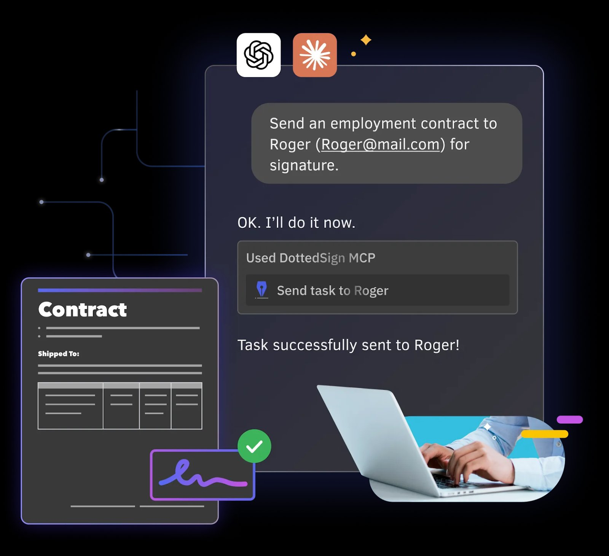
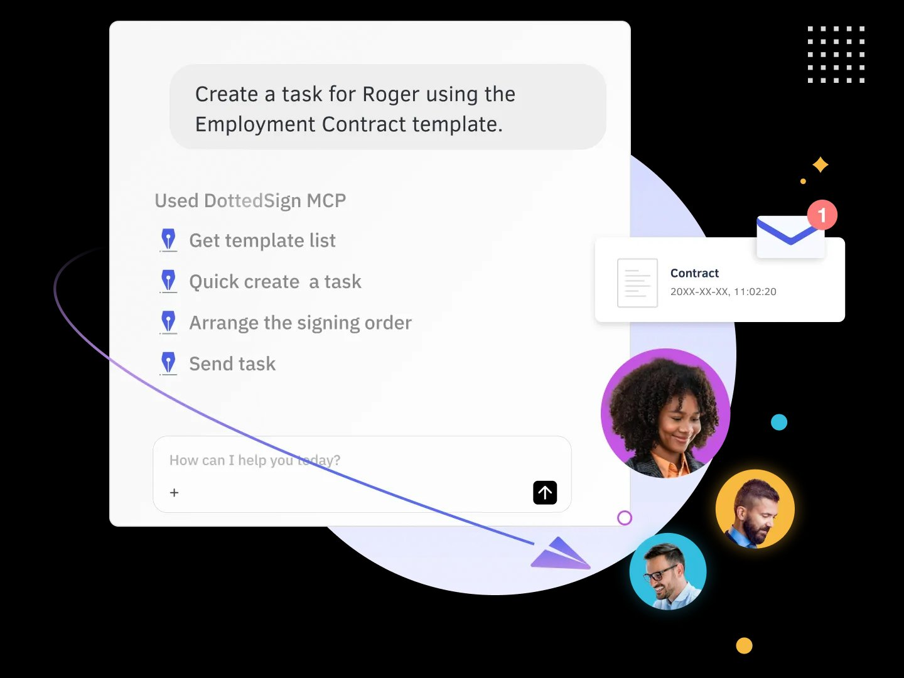
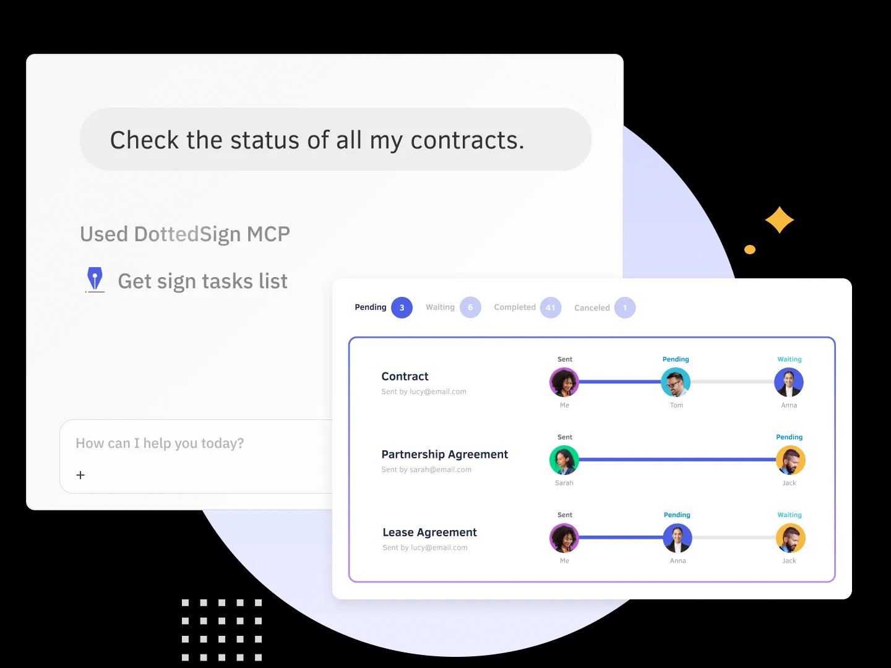
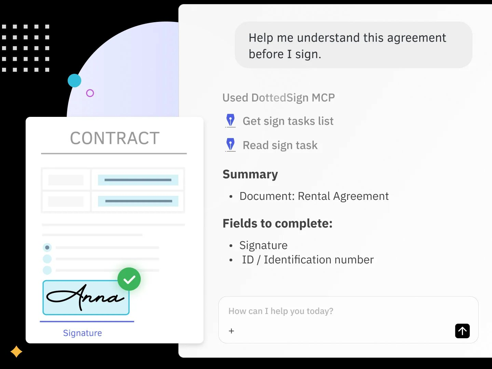
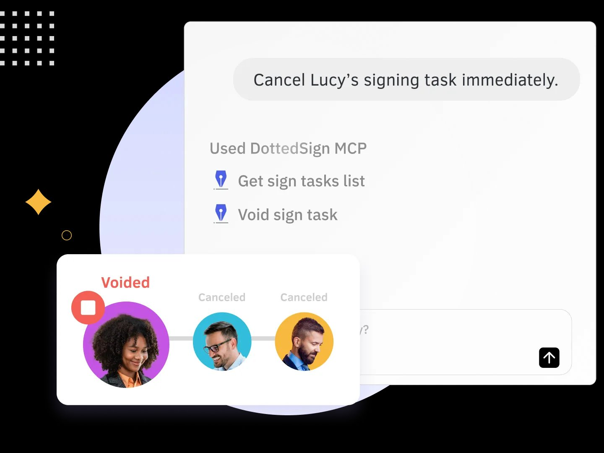

<p align="center">
  
</p>

# DottedSign MCP


Connect your AI assistant (Claude or ChatGPT) to DottedSign — create signing tasks, track document status, manage templates, and more using natural language.

---

## What is DottedSign MCP?

DottedSign MCP lets you run your entire eSignature workflow just by chatting with an AI assistant — **no coding, no API keys, no app-switching**. Tell Claude or ChatGPT what you need in plain language, and it talks to DottedSign for you: sending contracts, chasing signatures, checking status, and more.

- **No technical background needed** — if you can send a message, you can use it.
- **Works inside the AI tools you already use** — Claude, ChatGPT, and Claude Code.
- **Open standard** — built on the Model Context Protocol (MCP) by Anthropic.

### Who is this for?

- Sales / HR / Legal / Ops teams who send contracts regularly
- Founders and small teams who want to run their signing workflow without switching between apps
- Developers wiring eSignature into their own AI agents

---

## Before You Begin

You only need two things:

1. A **DottedSign account** — all plans can connect to DottedSign MCP, but sending signing tasks requires a paid plan. See [Is it free?](#faq) for details.
2. One supported **AI assistant** — see [Which Platform Should I Choose?](#which-platform-should-i-choose) below.

---

## Setup on Claude

Works on free accounts. Steps are the same for both Claude Desktop and claude.ai.

1. Click your account icon → **Settings**
2. Select **Connectors** → **Add Connector**
3. Paste the following URL:

```
https://mcp.dottedsign.com/dottedsign-api/mcp
```

4. Claude will walk you through signing in to DottedSign to authorize access

Once connected, just tell Claude what you want — for example: *"Show me my recent signing tasks in DottedSign."*

---

## Setup on Claude Code

Run the following command in your terminal:

```
claude mcp add --transport http dottedsign https://mcp.dottedsign.com/dottedsign-api/mcp
```

Claude Code will prompt you to authorize via DottedSign on first use.

---

## Setup on ChatGPT

May require a paid plan.

1. Go to [chatgpt.com](https://chatgpt.com), click your account icon → **Settings**
2. Select **Connectors** → **Add Connector**
3. Paste the following URL:

```
https://mcp.dottedsign.com/dottedsign-api/mcp
```

4. Sign in to DottedSign to complete authorization

---

## Which Platform Should I Choose?

| Platform | Account needed | Best for |
| --- | --- | --- |
| **Claude** (Desktop / web) | Free account works | Everyday users — fastest way to start |
| **Claude Code** | Claude account | Developers working in the terminal |
| **ChatGPT** | Paid plan may be required | ChatGPT-first teams |

---

## What You Can Do

Once connected, try asking your AI assistant:

- "List all my pending signing tasks"
- "Create a new signing task from the Sales Contract template and send it to <xxx@example.com>"
- "What's the signing status of my latest document?"
- "Get the download link for a completed contract"

---

## Use Cases — See It in Action

Real prompts, real results. Each example shows what you type and what the AI does.

### 1. Send a contract from a template in seconds

*"Create a task for Roger using the Employment Contract template."* → The AI pulls the template, creates the task, arranges the signing order, and sends it.



### 2. Track every contract at a glance

*"Check the status of all my contracts."* → The AI returns a live overview: pending, waiting, completed, and canceled.



### 3. Understand an agreement before you sign

*"Help me understand this agreement before I sign."* → The AI summarizes the document and lists the fields you still need to complete.



### 4. Cancel or void a task instantly

*"Cancel Lucy's signing task immediately."* → The AI finds the task and voids it right away.



---

## What Happens Under the Hood

Behind every request, the AI calls one or more DottedSign tools — so you never have to:

- `Get sign tasks list` — list and filter your signing tasks
- `Read sign task` — read and summarize a task's content and fields
- `Get template list` — browse your saved templates
- `Quick create a task` — create a task from a template
- `Arrange the signing order` — set who signs first
- `Send task` — deliver the task to signers
- `Void sign task` — cancel or void a task

> The exact tool set is defined by the MCP server and may grow over time.

---

## Tips for Better Results

- Include the **signer's name and email** so the AI can route the task.
- Name the **template** exactly as it appears in your DottedSign account.
- Refer to documents **by name** when asking for status (e.g. "status of the Lease Agreement").
- You can chain steps: *"Create a task from the NDA template, sign it myself first, then send it to Roger."*
- Use **FieldSearchKey** (field keywords) in your templates to make data mapping easier. For example, when connecting a CRM, you can map specific CRM fields straight into the matching fields of your DottedSign template.

---

## FAQ

**Q1. Do I need to know how to code?**
A. No. You set it up once by pasting a URL, then everything is done in plain language.

**Q2. Is it free?**
A. The MCP connector itself is free, and Claude works on free accounts (ChatGPT may require a paid plan). A DottedSign account is required to use DottedSign MCP. All plans support AI platform integration, but some features are limited in the Free and Pro plans (such as sending signing tasks). To fully leverage AI-powered workflows—including creating signing tasks, sending documents, tracking progress, and signing documents—we recommend upgrading to the DottedSign Business plan.

**Q3. Which AI assistants are supported?**
A. Claude (Desktop and web), Claude Code, and ChatGPT today — and any MCP-compatible client over time.

**Q4. Do the people I send to need DottedSign or an AI tool?**
A. No. Recipients sign through the normal DottedSign email link — no account or AI tool required on their side.

**Q5. Can the AI sign documents for me?**
A. Yes. If you've already created a signature in your DottedSign account, the AI can sign documents on your behalf — as well as prepare, send, track, and manage tasks. You stay in control of what gets created and sent.

**Q6. Is my data secure?**
A. Access is granted through DottedSign's secure authorization (OAuth). You decide what to connect and can revoke access at any time.

**Q7. How do I disconnect?**
A. Remove the connector in your AI assistant's **Settings → Connectors**, and/or revoke access from your DottedSign account.

**Q8. What languages can I use?**
A. You can prompt in natural language, including English, 繁體中文, 日本語, and more.

---

## Security & Privacy

- **You authorize access** through DottedSign — and can revoke it at any time.
- **Signatures stay legally binding** through DottedSign's signing process.
- **Recipients sign normally** — no AI tool or extra account needed on their end.

---

## Troubleshooting

- **Connector won't add / URL rejected** — double-check the URL is pasted exactly, with no trailing spaces.
- **Authorization failed** — make sure you're logged in to DottedSign in the same browser, then retry.
- **AI can't find a task** — refer to it by document name, or confirm it exists in your DottedSign account.
- **Can't send a signing task on a free account** — the Free plan can't create document templates (the Pro plan includes only one), so template-based sending is blocked. Upgrade your plan to unlock full sending — see [pricing](https://www.dottedsign.com/pricing/).

---

## Resources & Support

- Product page — [dottedsign.com/integrations/mcp](https://www.dottedsign.com/integrations/mcp)
- [Help Center](https://support.dottedsign.com/) and [contact support](https://www.dottedsign.com/contact-cs/)
- [Request a demo](https://www.dottedsign.com/request-demo/)
- Also try **[KDAN PDF MCP](https://pdf-reader.kdandoc.com/products/mcp/claude)** for AI-driven PDF editing and redaction.
